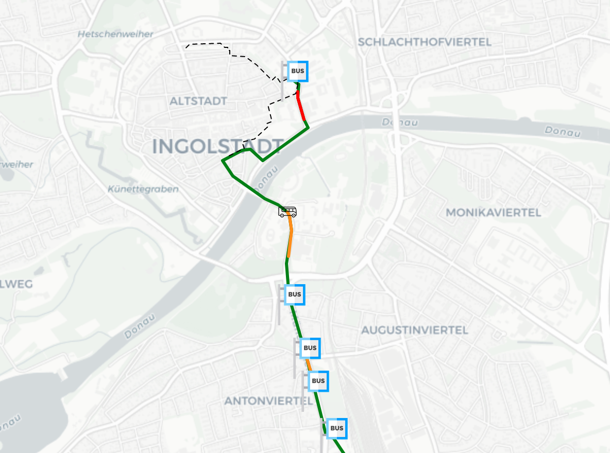

# Voice and Graphical Interface for VGI

This project builds a new interface for the VGI public transport app that enables users to use voice commands to interact with the app, making it more accessible to visually impaired users, and adding functionality to make it a better user experience.

## Motivation

Like millions of others navigating the hustle of commuting every day, we too were living our own stories in this modern world where time is of the essence. Buses arriving at the last minute, followed by the anxiety of missing them – these troubles had become part of this urban life.

Some of us frequently missing buses and racing against time to catch them at the last minute. Every day, some embarked on the quest to make it to work or somewhere else on time, yet sometimes we couldn’t make it.

## Build Status

The voice recognition can be triggered by the trigger word "Genie" and can take simple inputs regarding location and time and only in the English language. It works for these simple cases but there is not yet any error handling.
The text-to-speech prompts the user for each input when required and offers some advice regarding the weather which pulls live weather data for the city of Ingolstadt.
The live bus tracking is currently simulated using sample data and can automatically refresh in the browser on some systems, but not all.
There are also some fixed walking routes displayed on the map but it can't perform any navigation.
The current build is not yet set up to receive live GPS data.

## Screenshots
Current Map View

## Packages Used
`openmeteo-requests` for the weather api 
 
`requests-cache` to access weather data 
 
`retry-requests` to retry failed requests 
 
`csv` to access sample data 
 
`datetime` for time calculations 
 
`folium` for map generation 
 
`time` for waiting 
 
`pandas` for coordinate storage 
 
`azure-cognitiveservices-speech` for voice recognition 
 
`pyttsx3` for text to speech 
 

## Features
We have rebranded the existing app to modernise its look. Our live bus-tracking is a new feature that gives users peace-of-mind when dealing with delays and our voice assistant makes the app easier to use and more accessible to people with visual impairments and also provides tailored travel advice based on current conditions.

## Contributors
Amar Munoglu, Cassandra Soong, Md Rafidul Islam Rafid, Fatih Ozkan, Ksenija Vojvodic, Thomas Williams

